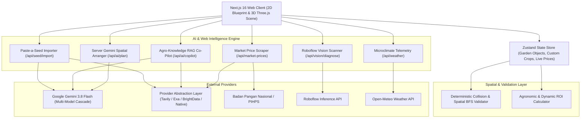

# AgriSensa Garden Studio

> **Spatial 2D/3D Precision Garden Studio with Multimodal Gemini AI, Provider Abstraction Layer & Agronomic Geometry Engine**  
> **Production Live URL:** [https://agrisensa-garden-studio-production.up.railway.app](https://agrisensa-garden-studio-production.up.railway.app)  
> **Repository:** [https://github.com/yandri918/agrisensa_garden_studio](https://github.com/yandri918/agrisensa_garden_studio)

---

## Overview

**AgriSensa Garden Studio** is an open-source spatial garden planning and agronomic intelligence platform designed to transform urban homesteads, backyard plots, and community food projects into measurable, productive, and economically viable food systems.

It bridges the gap between digital design and agricultural execution:
1. **Interactive 2D Blueprint**: Millimeter-accurate spatial layout editor with grid snap (0.25m), obstacle placement, and zone management.
2. **Interactive 3D Digital Twin**: Real-time 3D visualization powered by Three.js and React Three Fiber with orbital, top-down, and human eye-level camera presets.
3. **Live Market Price & Dynamic ROI**: Real-time commodity price intelligence from Indonesian agricultural price portals (Bapanas / PIHPS) via Provider Abstraction Layer to compute dynamic harvest revenues, baseline yield values, and price volatility risks.
4. **"Paste-a-Seed" Smart Variety Importer**: Paste any seed product link (Cap Panah Merah, Known-You Seed, Tunas Agro) to scrape and parse precision agronomic specifications (HST harvest age, spacing cm, yield kg/m2, companion plants) via Provider Abstraction Layer and Google Gemini.
5. **Agro-Knowledge RAG Co-Pilot**: Interactive agricultural consultation assistant powered by Gemini 3.8 Flash, grounded with real-time web research citations (Provider Abstraction Layer) and curated Balai Penelitian Tanaman Sayuran (Balitsa Kementan) recommendations.
6. **Roboflow Computer Vision Leaf Scanner**: In-situ optical leaf diagnosis to detect pest infestations and nutritional deficiencies directly from bed inspections.
7. **Deterministic Spatial Collision Engine**: Zero-collision boundary detection, exclusion zone enforcement, and BFS access-path graph traversal from garden entrances.
8. **Clean Industry Design System**: Dark glassmorphic interface, custom HSL color tokens, and strictly zero emojis with Lucide SVG iconography.

---

## System Architecture



---

## Core Feature Highlights

### 1. Live Market Price & Dynamic ROI Engine
- Scrapes live horticultural commodity prices (Cabai Rawit, Cabai Merah, Tomat, Selada, Pakcoy, Bayam, Kangkung, Seledri) directly from official Indonesian food price portals.
- Calculates gross revenue delta percentage (`deltaPct`), baseline vs live valuation in Indonesian Rupiah (IDR), and alerts users to commodity volatility.
- Automatic caching (15-minute TTL) with manual refresh triggers.

### 2. "Paste-a-Seed" — Smart Variety & Seed Importer
- Eliminates manual input of seed specifications. Users paste e-commerce or seed company URLs (e.g., `https://panahmerah.id/product/tomat-servo-f1`).
- Scrapes product descriptions via Provider Abstraction Layer and parses them via Gemini into validated `VegetableEntry` structures:
  - Hari Panen (HST)
  - Jarak Tanam Ideal (cm)
  - Potensi Hasil Tanah (kg/m2) & Hidroponik (g/lubang)
  - Kebutuhan Sinar Matahari (Full / Partial / Shade)
  - Tanaman Pendamping Sinergis (Companion Plants)
- Instantly creates new raised beds on the canvas or stores custom crops in browser `localStorage`.

### 3. Agro-Knowledge RAG untuk Gemini Co-Pilot
- Context-aware agronomic consulting: the assistant reads your active plot size (m2), currently planted crops, physical facilities, and live weather telemetry.
- Grounded with Provider Abstraction Layer Real-Time Search API to retrieve active research bulletins from Balai Penelitian Tanaman Sayuran (Balitsa Kementan), BPTP, and agricultural journals.
- Output formatted as interactive **Visual Strategy Cards** with category tags (*Pencegahan Fisik*, *Companion Planting*, *Organik Hayati*, *Tindakan Kuratif*).
- Interactive 1-click garden triggers: Co-Pilot recommendations (e.g., planting Marigold to repel thrips) include a "+ Terapkan" button that immediately adds the companion bed to the canvas.

### 4. Dual Viewport: 2D Blueprint & 3D Three.js Digital Twin
- **2D Mode**: Millimeter-scale blueprint with grid snapping, object selection, dimension inputs, and directional water/entrance indicators.
- **3D Mode**: Interactive digital twin rendered with Three.js, React Three Fiber, and Drei. Supports orbital navigation, foliage shading, solar elevation, and procedural bed rendering.

### 5. In-Situ Vision Scanner & Microclimate Telemetry
- Inspects raised beds and plant health using Roboflow Computer Vision API to detect pests (thrips, aphids, armyworms) and nutrient stress.
- Open-Meteo microclimate telemetry integration feeding ambient temperature, relative humidity, and rainfall forecasts directly into daily watering recommendations.

---

## Tech Stack

- **Framework**: Next.js 16 (App Router, Turbopack)
- **Language**: TypeScript 5
- **3D Graphics**: Three.js, `@react-three/fiber`, `@react-three/drei`
- **State Management**: Zustand with `localStorage` persistence
- **Web Scraping & RAG**: Provider Abstraction Layer (`searchProvider`, `scraperProvider` with Tavily, Exa, Bright Data, and Native failover)
- **Large Language Model**: `@google/genai` (Google Gemini 3.8 Flash with multi-model cascade: `gemini-3.8-flash`, `gemini-3.7-flash`, `gemini-3.5-flash`, `gemini-flash-latest`)
- **Computer Vision**: Roboflow Inference API
- **Weather API**: Open-Meteo
- **Validation**: Zod & custom spatial BFS graph traversal
- **Styling**: Vanilla CSS Design Tokens (Dark glassmorphism, responsive HSL palette)
- **Iconography**: Lucide React (Strictly zero emojis)

---

## Getting Started

### 1. Clone the Repository

```bash
git clone https://github.com/yandri918/agrisensa_garden_studio.git
cd agrisensa_garden_studio
npm install
```

### 2. Configure Environment Variables

Create a `.env.local` file in the project root:

```env
# Google Gemini API Key (Server-side runtime)
GEMINI_API_KEY=your_gemini_api_key_here

# Provider Abstraction Layer (Search & Scraping)
EXA_API_KEY=your_exa_api_key_here
TAVILY_API_KEY=your_tavily_api_key_here
BRIGHTDATA_API_KEY=your_brightdata_api_key_here

# Roboflow Vision API Key (Optional, for plant health inspection)
ROBOFLOW_API_KEY=your_roboflow_api_key_here
ROBOFLOW_MODEL_ID=plant-doc-disease-detection
ROBOFLOW_MODEL_VERSION=1
```

> **Note:** The platform includes offline heuristic safety nets and benchmark fallbacks. The application will function with deterministic rules even if external API limits are exceeded.

### 3. Run Development Server

```bash
npm run dev
```

Open [http://localhost:3000](http://localhost:3000) in your browser.

### 4. Build for Production

```bash
npm run build
npm run start
```

---

## API Endpoints

| Endpoint | Method | Description |
|---|---|---|
| `/api/seed/import` | `POST` | Scrapes seed product URLs via Provider Abstraction Layer and returns parsed agronomic specs using Gemini AI. |
| `/api/market-prices` | `GET` | Fetches live horticultural commodity prices from Bapanas/PIHPS via Provider Abstraction Layer with 15-minute cache. |
| `/api/ai/copilot` | `POST` | Real-time Agro-Knowledge RAG chat combining garden state, web research citations, and Gemini advice. |
| `/api/ai/plan` | `POST` | Server-side spatial layout auto-arrangement and custom garden generation. |
| `/api/vision/diagnose` | `POST` | Optical pest and disease diagnosis using Roboflow Computer Vision models. |
| `/api/weather` | `GET` | Microclimate telemetry and irrigation forecasting via Open-Meteo. |

---

## License

MIT License. Developed for precision urban farming and food sovereignty.
